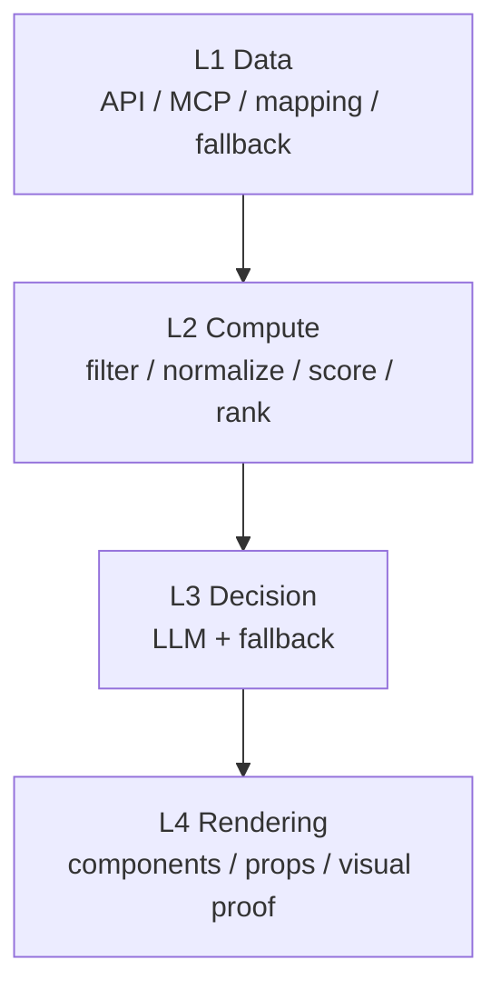

# AntSkill Creator

A structured operating system for moving a skill from requirements to a deliverable package.

[](https://x.com/Antseer_ai) [](https://t.me/AntseerGroup) [](https://github.com/antseer-dev/OpenWeb3Data_MCP) [](https://medium.com/@antseer/)

English | [简体中文](README.zh.md)

---

## Core mechanisms

| Mechanism | Purpose | File |
|------|------|----------|
| Paradigm selection | Distinguishes implementation-first (A), spec-first (B), and dual-mode (C) skills | `methodology/paradigms.md` |
| S1–S6 stage gates | Requirements → prototype → refinement → PRD → delivery → review, each with entry/exit rules | `sop/`, `quality/gates.md` |
| 4-layer pipeline | Separates data, compute, decision, and rendering | `prompts/layer_design_guides.md` |
| Source-of-truth arbitration | Defines precedence when PRD, API spec, prompts, and demo conflict | `methodology/source-of-truth.md` |
| Production / Prototype boundary | Separates visual reference from production contract | `methodology/responsibility-split.md` |

## Repository facts

| Metric | Value |
|------|------|
| Skill paradigms | 3 |
| SOP stages | 6 |
| Methodology modules | 4 |
| Reference templates | 9 |
| Built-in example packages | 4 |
| Yield Desk PRD | 1060 lines |
| DualYield tests | 32/32 passed |
| Yield Desk tests | 16/16 passed |

## Architecture




## Directory structure

```text
antskill-creator/
├── SKILL.md                  # orchestration logic and decision tree
├── methodology/              # paradigms, SoT, responsibility split
├── sop/                      # S1–S6 stage playbooks
├── prompts/                  # L1–L4 design guides
├── quality/                  # gates and evaluation rules
├── templates/                # templates, skeletons, validators
└── examples/                 # full example packages
```

## Cases

### DualYield — C paradigm (dual-mode)

Includes product spec, pipeline code, frontend prototype, tests, and technical onboarding docs. L2 tests pass 32/32.

Path: `examples/dualyield/`


### Yield Desk — C paradigm (handoff-heavy)

Includes a 1060-line layered PRD, high-fidelity frontend prototype, and engineering handoff docs. L2 tests pass 16/16.

Path: `examples/yield-desk/`


### SeerClaw Ref — B paradigm (spec-first)

A pure reference package for scanner/analyzer-style product specs.

Path: `examples/seerclaw-ref/`

## Output types

| Paradigm | Output |
|------|------|
| A — Implementation-first | pipeline code, tests, frontend demo |
| B — Spec-first | spec docs, `SKILL.md`, frontend demo, metadata |
| C — Dual-mode | A + B |

## Usage

```text
/antskill-creator create a skill for on-chain treasury monitoring
/antskill-creator split this large skill into scanner and analyzer
/antskill-creator package this PRD + prototype into a GitHub-shareable skill
/antskill-creator review this skill and produce a gap report before handoff
```

Internal flow: classify paradigm → collect requirements → prototype → refine → PRD/spec → package + review.

## Best fit

**Good for:** teams that need product clarity, engineering handoff quality, and reusable skill methodology.

**Not good for:** throwaway personal skills or one-shot prompt scaffolding.

---

Built by [AntSeer](https://antseer.ai) · Powered by AI Agents
