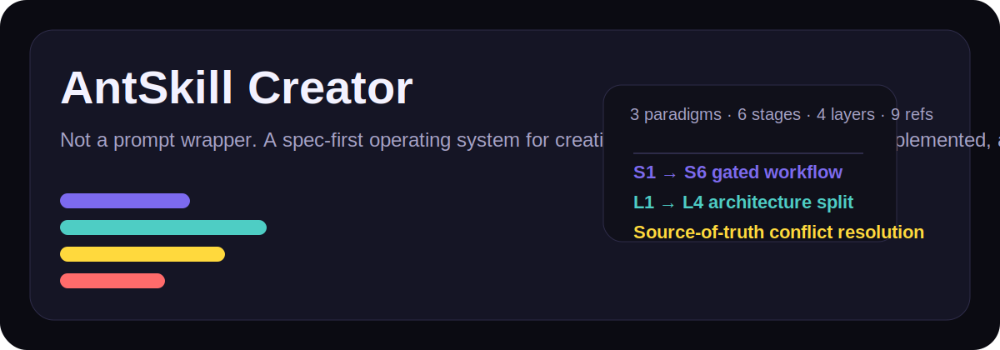
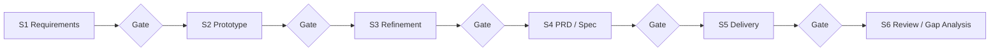
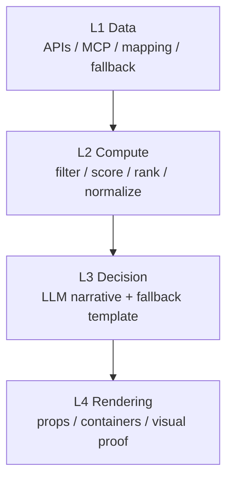
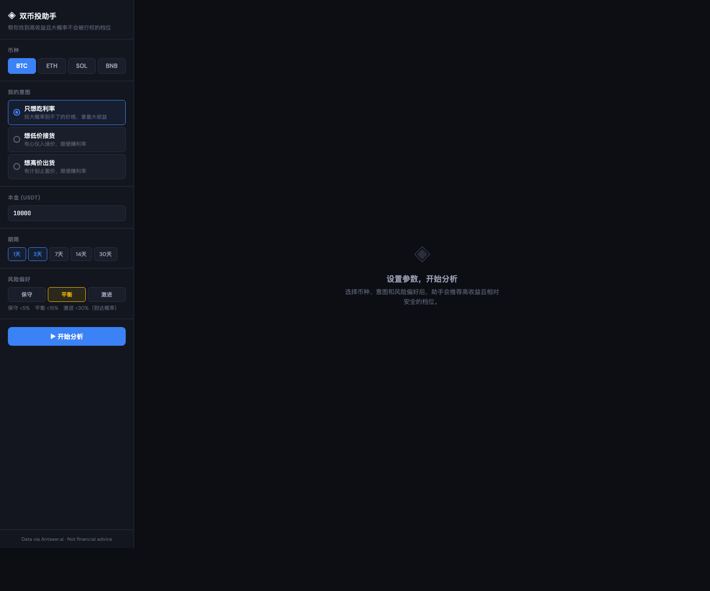
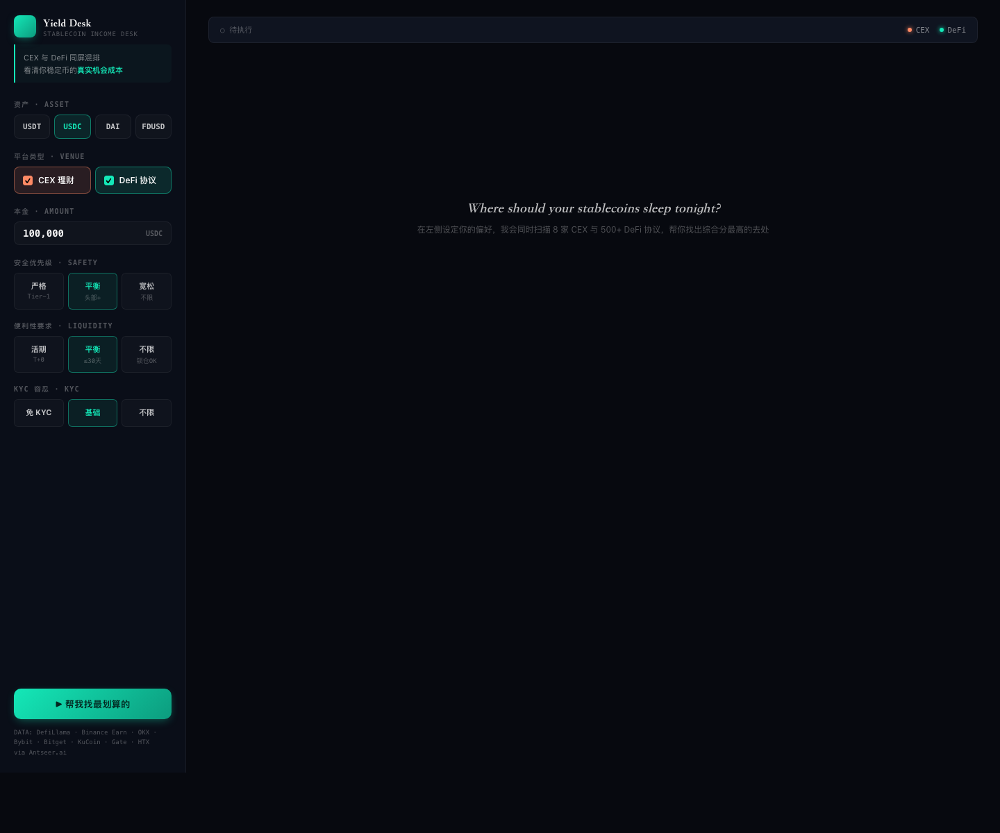

<div align="center">



# AntSkill Creator

**A spec-first operating system for building skills that can be reviewed, implemented, and shipped — not just generated.**

[](https://x.com/Antseer_ai) [](https://t.me/AntseerGroup) [](https://github.com/antseer-dev/OpenWeb3Data_MCP) [](https://medium.com/@antseer/)

English | [简体中文](README.zh.md)

</div>

---

## What Makes It Different

Most “skill factories” stop at prompt scaffolding. AntSkill Creator is built for a harder problem:

> turning a vague idea into a skill package that survives design review, engineering implementation, packaging, and GitHub sharing.

It does that with **five enforceable systems**, all present in this repo:

| System | What it does | Evidence in this repo |
|---|---|---|
| **Paradigm selection** | Forces you to choose **A implementation / B spec-first / C dual-mode** before design starts | `methodology/paradigms.md` |
| **Stage-gated workflow** | Breaks creation into **S1 → S6** with explicit deliverables and red/yellow/green gates | `SKILL.md`, `quality/gates.md`, `sop/` |
| **4-layer architecture** | Separates **L1 data / L2 compute / L3 decision / L4 rendering** to keep skills testable and maintainable | `SKILL.md`, `prompts/layer_design_guides.md` |
| **Source-of-truth arbitration** | Resolves conflicts between PRD, API spec, backend logic, AI prompts, and demo HTML | `methodology/source-of-truth.md` |
| **Production-vs-Prototype rules** | Explicitly marks what is visual reference vs. production contract, with retry/degrade behavior | `methodology/responsibility-split.md` |

This is the core differentiator: **it does not only generate files — it defines how those files stay consistent under pressure.**

---

## The Operating Model, at a Glance

### 1) Stage system: from idea to shipped package



### 2) Runtime architecture: every skill is split into 4 layers



### 3) Why this matters

A generic factory can produce a folder.
AntSkill Creator tries to produce a **system**:

- a process for choosing the right skill shape
- a reproducible way to move from demo to PRD
- a package structure that engineers can actually implement against
- a review model that catches contradictions before handoff

---

## Hard Facts From This Repository

These are not marketing numbers. They are directly backed by files in this repo.

| Fact | Value |
|---|---:|
| Skill paradigms | **3** (`A / B / C`) |
| SOP stages | **6** (`S1 → S6`) |
| Methodology modules | **4** |
| Reference doc templates | **9** |
| Built-in example packages | **4** |
| Yield Desk PRD length | **1060 lines** |
| DualYield example test result | **32 / 32 passed** |
| Yield Desk example test result | **16 / 16 passed** |

---

## Engineering Architecture

```text
antskill-creator/
├── SKILL.md                  # orchestration brain
├── methodology/              # principles, paradigms, SoT, responsibility split
├── sop/                      # stage-by-stage operating procedures
├── prompts/                  # L1-L4 design guidance
├── quality/                  # gates and review criteria
├── templates/                # reusable skeletons, refs, scripts, metadata
└── examples/                 # concrete outputs that prove the system works
```

### Repo modules

| Module | Role |
|---|---|
| `methodology/` | the “constitution” — paradigms, source-of-truth, split of responsibility |
| `sop/` | the operating playbooks for each stage |
| `quality/` | quality gates and auto-review rubric |
| `templates/` | the reusable skeletons for docs, code, metadata, icons, validators |
| `examples/` | real packages that demonstrate the methodology in practice |

---

## Case Studies: Proof, Not Claims

### Case 1 — DualYield

A **dual-mode** example package that combines:
- product spec
- pipeline code
- frontend prototype
- tests
- technical onboarding docs

**Evidence:** `examples/dualyield/`

- Example type: **C (dual-mode)**
- L2 test suite: **32 / 32 passed**
- Shows how AntSkill Creator handles: quantitative ranking, TA logic, PRD, handoff docs, and package facade together



### Case 2 — Yield Desk

A stronger example for **spec depth and layered PRD quality**.

**Evidence:** `examples/yield-desk/`

- Example type: **C (dual-mode / handoff-heavy)**
- L2 test suite: **16 / 16 passed**
- Includes a **1060-line layered PRD** and a high-fidelity frontend demo
- Shows how the system handles handoff-oriented packaging, not just runnable code



### Case 3 — SeerClaw Ref

A **spec-first** reference package.

**Evidence:** `examples/seerclaw-ref/`

- Example type: **B (spec-first)**
- No heavy pipeline implementation required
- Useful for teams that need engineering guidance more than embedded code

---

## What This Skill Is Best At

### ✅ Best for

- turning a PM idea into a skill with a disciplined delivery path
- producing skills that need both **product clarity** and **engineering implementability**
- splitting work into demo, spec, package, and review stages
- creating skills that have to survive a real GitHub handoff
- building libraries of reusable skill patterns instead of one-off prompt hacks

### ❌ Not ideal for

- instant one-shot prompt scaffolding with no review loop
- tiny personal throwaway skills where process would be overkill
- teams that do not care about source-of-truth discipline or package consistency

---

## Package Outputs

Depending on the paradigm you choose, AntSkill Creator can output:

| Mode | Typical outputs |
|---|---|
| **A — Implementation-first** | pipeline code, tests, frontend demo |
| **B — Spec-first** | reference docs, `SKILL.md`, frontend demo, metadata |
| **C — Dual-mode** | both implementation and spec package |

This matters because not every skill should become code. Sometimes the highest-value deliverable is a **production-grade spec package**.

---

## How To Use It

Send your agent something like:

```text
/antskill-creator create a skill for on-chain treasury monitoring
/antskill-creator split this large skill into scanner and analyzer
/antskill-creator package this PRD + prototype into a GitHub-ready skill
/antskill-creator review this skill and produce a gap report before handoff
```

### The internal flow

1. **Classify the paradigm**
2. **Collect requirements**
3. **Build a fast prototype**
4. **Refine based on feedback**
5. **Reverse-engineer the PRD/spec package**
6. **Package and review**

---

## File Guide

| File / Folder | Why it matters |
|---|---|
| `SKILL.md` | central operating logic and decision tree |
| `methodology/paradigms.md` | why the repo has 3 modes instead of one generic generator |
| `quality/gates.md` | the enforcement layer that makes the process non-hand-wavy |
| `methodology/source-of-truth.md` | conflict arbitration between docs and demos |
| `methodology/responsibility-split.md` | production-vs-prototype boundary and retry contract |
| `examples/README.md` | roadmap for using the examples as proof points |

---

## Review Verdict

**Current state:** strong methodology core, strong examples, missing shareable facade.

What was missing before packaging:
- no root `README.md` / `README.zh.md`
- no `agents/openai.yaml`
- no valid `SKILL.md` frontmatter
- junk files / malformed directories hurting trust

What this package now has:
- valid frontmatter
- GitHub-ready bilingual README
- skill facade metadata
- icons and screenshots
- cleaned root package layout

---

## Disclaimer

AntSkill Creator improves the **system quality** of skill creation.
It does **not** magically make weak product thinking strong.

If requirements are vague, data sources are unknown, or the target workflow is incoherent, this repo will make that visible sooner — which is exactly the point.

---

<div align="center">

Built by [AntSeer](https://antseer.ai) · Powered by AI Agents

</div>
