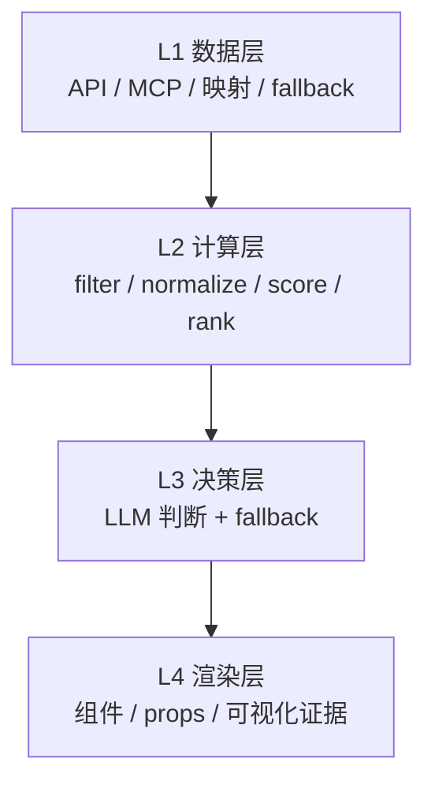

<div align="center">


# AntSkill Creator

把 skill 当产品来做：**需求 → 原型 → 规格 → 打包 → review**。

[](https://x.com/Antseer_ai) [](https://t.me/AntseerGroup) [](https://github.com/antseer-dev/OpenWeb3Data_MCP) [](https://medium.com/@antseer/)

[English](README.md) | 简体中文

</div>

---

## 为什么要有这个 skill

很多 skill 工厂擅长的是“生成一个目录”。

AntSkill Creator 解决的是另一个问题：

> **怎么把一个想法，稳定推进成一个能过 review、能交给工程、能打包上 GitHub 的 skill。**

它把三个通常容易混乱的问题，提前固定下来：

1. **你到底在做哪一类 skill？**
   - 实现型
   - 规范型
   - 双模
2. **你现在处在哪个阶段？**
   - 需求
   - 原型
   - 精修
   - PRD / spec
   - 交付
   - review
3. **每个决策该放在哪一层？**
   - L1 数据
   - L2 计算
   - L3 决策
   - L4 渲染

---

## 它和一般 skill 工厂的差别

| 一般 skill 工厂 | AntSkill Creator |
|---|---|
| 从模板开始 | 从阶段化流程开始 |
| 通常只有一种产物形态 | 支持 **3 种范式** |
| 偏 prompt 生成 | 偏架构和规格约束 |
| 文档和 demo 容易漂移 | 有 **Source of Truth 裁决机制** |
| review 可有可无 | review 是正式阶段 |
| 生成出来就算完成 | 要过 gate 才算交付 |

对应证据都在 repo 里：
- `methodology/paradigms.md`
- `quality/gates.md`
- `methodology/source-of-truth.md`
- `methodology/responsibility-split.md`
- `sop/`

---

## 工作模型

### 1）工作流


每个阶段都有明确质量门，定义在 `quality/gates.md`。

### 2）运行架构



### 3）Source of Truth

当 PRD、API spec、Prompt、Demo HTML 互相冲突时，这个 repo 明确规定了谁优先。
规则在 `methodology/source-of-truth.md`。

---

## 这个仓库里的硬事实

| 指标 | 数值 |
|---|---:|
| 范式数量 | **3** |
| SOP 阶段数 | **6** |
| 方法论模块 | **4** |
| 引用文档模板 | **9** |
| 内置示例包 | **4** |
| Yield Desk PRD 长度 | **1060 行** |
| DualYield 示例测试 | **32 / 32 通过** |
| Yield Desk 示例测试 | **16 / 16 通过** |

---

## 案例

### DualYield

`examples/dualyield/`

一个双模示例包，里面同时有：
- pipeline 代码
- 前端原型
- 产品文档
- handoff 文档
- 测试

结果：**32 / 32 测试通过**。


### Yield Desk

`examples/yield-desk/`

一个更偏 spec / handoff 的示例：
- 分层 PRD
- 前端原型
- 评分逻辑
- 包装门面

结果：**16 / 16 测试通过**。


### SeerClaw Ref

`examples/seerclaw-ref/`

一个规范型参考包，适合“代码不一定放在 skill 里，但规范必须写清楚”的场景。

---

## 仓库结构

```text
antskill-creator/
├── SKILL.md
├── methodology/
├── sop/
├── prompts/
├── quality/
├── templates/
└── examples/
```

| 目录 | 作用 |
|---|---|
| `methodology/` | 原则、范式、SoT、生产规则 |
| `sop/` | 分阶段操作手册 |
| `quality/` | 质量门和 review 标准 |
| `templates/` | 文档、代码骨架、元数据、资产 |
| `examples/` | 用真实案例证明系统有效 |

---

## 最适合拿来做什么

### ✅ 适合
- 把 PM 想法推进成结构化 skill 包
- 做需要产品清晰度 + 工程交接能力的 skill
- 做 spec-first 包，而不只是 runnable prototype
- 做可以上 GitHub、可以交给团队协作的 skill

### ❌ 不适合
- 很小的一次性 throwaway skill
- 只想一句话快速出模板
- 不在乎 review、spec 和 package 一致性的场景

---

## 使用示例

```text
/antskill-creator 做一个链上国库监控 skill
/antskill-creator 把这个 PRD + 原型打包成可分享的 skill
/antskill-creator 把这个大 skill 拆成 scanner 和 analyzer
/antskill-creator review 一下这个 skill，再交给工程
```

---

## 一句话总结

AntSkill Creator 不是为了“最快生成”。

它是为了让 skill 在**多人协作、反复修改、进入工程实现之后，仍然保持一致性**。

这就是它的价值。

---

<div align="center">

Built by [AntSeer](https://antseer.ai) · Powered by AI Agents

</div>
