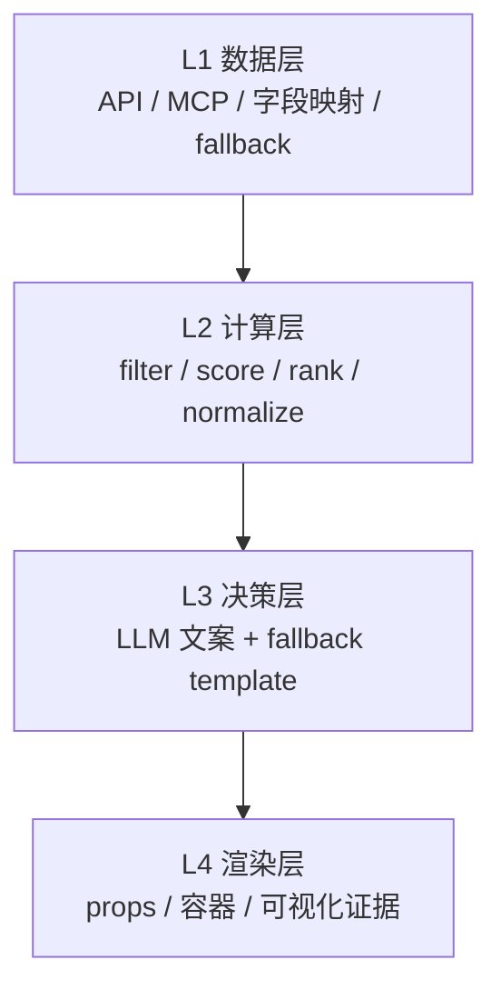

<div align="center">


# AntSkill Creator

**这不是一个“随手拼 prompt 的 skill 工厂”，而是一套把 skill 从想法推进到可评审、可实现、可交付包的操作系统。**

[](https://x.com/Antseer_ai) [](https://t.me/AntseerGroup) [](https://github.com/antseer-dev/OpenWeb3Data_MCP) [](https://medium.com/@antseer/)

[English](README.md) | 简体中文

</div>

---

## 它和一般 Skill 工厂到底差在哪？

大多数所谓“skill 工厂”，解决的是：

> 帮你更快生成一个目录和几份模板。

AntSkill Creator 要解决的是更难的问题：

> **怎么把一个模糊想法，稳定推进成一个能过设计 review、能给工程实现、能打包上传 GitHub 的 skill。**

这个 repo 的差异化，不在“会不会生成文件”，而在 **5 套约束机制** 都已经落到文件里：

| 机制 | 解决什么问题 | 证据文件 |
|---|---|---|
| **范式先决** | 先决定这是实现型、规范型，还是双模，不再一刀切 | `methodology/paradigms.md` |
| **S1~S6 阶段流水线** | 把需求、原型、精修、PRD、交付、review 串成固定工序 | `SKILL.md`、`sop/`、`quality/gates.md` |
| **4 层 Pipeline 分离** | 数据、计算、决策、渲染拆开，避免 skill 长成一团 | `SKILL.md`、`prompts/layer_design_guides.md` |
| **Source of Truth 裁决** | PRD、API spec、AI prompt、Demo HTML 冲突时谁说了算 | `methodology/source-of-truth.md` |
| **Production vs Prototype 规则** | 明确哪些是视觉参考，哪些才是生产契约 | `methodology/responsibility-split.md` |

一句话：

**普通 skill 工厂更像“模板生成器”；AntSkill Creator 更像“Skill 生产系统”。**

---

## 操作模型一眼看懂

### 1）阶段系统：从想法到交付包


### 2）运行架构：每个 skill 都按 4 层拆



### 3）为什么这很重要？

因为一个能长期维护的 skill，不只是“生成出来”，而是要同时满足：
- 产品说得清楚
- 工程能接着做
- Demo 和 PRD 不打架
- Review 时能快速发现 gap

---

## 这个仓库里的硬事实

这些不是宣传词，都是可以从文件里直接数出来的：

| 事实 | 数值 |
|---|---:|
| Skill 范式 | **3**（A / B / C） |
| SOP 阶段 | **6**（S1 → S6） |
| 方法论模块 | **4** |
| 引用文档模板 | **9** |
| 内置示例包 | **4** |
| Yield Desk PRD 行数 | **1060 行** |
| DualYield 示例测试结果 | **32 / 32 通过** |
| Yield Desk 示例测试结果 | **16 / 16 通过** |

---

## 工程架构

```text
antskill-creator/
├── SKILL.md                  # 主控大脑
├── methodology/              # 范式、SoT、职责边界、底层原则
├── sop/                      # S1~S6 各阶段操作手册
├── prompts/                  # L1~L4 设计指导
├── quality/                  # 质量门和评估标准
├── templates/                # 模板、骨架、元数据、校验脚本
└── examples/                 # 真实案例，用来证明这套系统能产出什么
```

### 各模块各干什么

| 模块 | 作用 |
|---|---|
| `methodology/` | 相当于“宪法”——定义底层规则 |
| `sop/` | 相当于“流水线工位说明书” |
| `quality/` | 相当于“质检机制” |
| `templates/` | 相当于“可复用骨架库” |
| `examples/` | 相当于“案例证明” |

---

## 案例：它不是空模板库

### 案例 1 — DualYield

这是一个 **双模（C 范式）** 示例包，里面同时有：
- 产品规范
- Pipeline 代码
- 前端原型
- 单测
- 技术 onboarding 文档

**证据路径：** `examples/dualyield/`

- 示例类型：**C（双模）**
- L2 测试：**32 / 32 通过**
- 展示了这套系统如何同时处理：量化评分、TA 逻辑、PRD、handoff 文档和 package 门面


### 案例 2 — Yield Desk

这个例子更能体现它的 **规范深度** 和 **handoff 能力**。

**证据路径：** `examples/yield-desk/`

- 示例类型：**C（偏 handoff 的双模）**
- L2 测试：**16 / 16 通过**
- 带一份 **1060 行的分层 PRD**
- 带高保真前端原型
- 展示了“不是直接上线，而是给工程继续做”的包该怎么写


### 案例 3 — SeerClaw Ref

这是一个更轻的 **规范型（B 范式）** 标杆包。

**证据路径：** `examples/seerclaw-ref/`

- 示例类型：**B（规范型）**
- 不强调重代码，而强调“工程应该按什么规范实现”
- 很适合做 scanner / analyzer 这类产品规范包参考

---

## 它最适合做什么？

### ✅ 适合

- 把 PM 想法推进成可执行的 skill 生产流程
- 做需要 **产品清晰度 + 工程可实现性** 的 skill
- 把 demo、PRD、打包、review 串成一条固定链路
- 为 GitHub / 团队协作准备可长期维护的 skill 包
- 建立一套可复用的 skill 方法论，而不是一次性 prompt hack

### ❌ 不适合

- 追求“一句话秒出一个 skill 文件夹”的极简场景
- 很小的个人 throwaway skill
- 完全不在乎 source-of-truth、review 和 package 规范的团队

---

## 它最终能产出什么？

| 模式 | 典型产出 |
|---|---|
| **A — 实现型** | pipeline 代码、测试、前端 demo |
| **B — 规范型** | references、`SKILL.md`、前端 demo、元数据 |
| **C — 双模** | A + B 同时具备 |

这点很关键：

**不是每个 skill 都应该写成代码。**
很多场景里，真正高价值的产物其实是一套**工程可执行的规范包**。

---

## 怎么用

你可以直接对 Agent 说：

```text
/antskill-creator 做一个链上国库监控 skill
/antskill-creator 把这个大 skill 拆成 scanner 和 analyzer
/antskill-creator 把这个 PRD + 原型打包成 GitHub 可分享的 skill
/antskill-creator review 一下这个 skill，先出 gap report 再交付
```

### 内部工作流

1. 先判断范式
2. 采集需求
3. 做快速原型
4. 按反馈精修
5. 逆向拆解成 PRD / 规范包
6. 打包并 review

---

## 关键文件导读

| 文件 / 目录 | 为什么值得先看 |
|---|---|
| `SKILL.md` | 主控逻辑和决策树都在这里 |
| `methodology/paradigms.md` | 为什么它不是单一模板生成器 |
| `quality/gates.md` | 为什么它不是“差不多就行”的工厂 |
| `methodology/source-of-truth.md` | 文档和 Demo 冲突时的裁决机制 |
| `methodology/responsibility-split.md` | production vs prototype 边界 |
| `examples/README.md` | 如何用案例来理解整套系统 |

---

## Review 结论

**当前状态：方法论核心很强、案例很强，但原始门面缺失。**

原始缺口包括：
- 缺根 README 双语
- 缺 `agents/openai.yaml`
- `SKILL.md` 没 frontmatter
- 根目录有脏文件 / 异常目录，影响工程可信度

这次补完后，它已经具备：
- 合法 frontmatter
- GitHub 可展示的双语 README
- skill 门面元数据
- 图标和案例截图
- 更干净的根目录结构

---

## 免责声明

AntSkill Creator 提升的是 **skill 创建这件事的系统质量**，不是替代产品判断。

如果需求本身就是模糊的、数据源不明确、目标工作流不成立，这个 repo 不会替你“装作没问题”，而是会更早把这些问题暴露出来——这恰恰是它的价值。

---

<div align="center">

Built by [AntSeer](https://antseer.ai) · Powered by AI Agents

</div>
